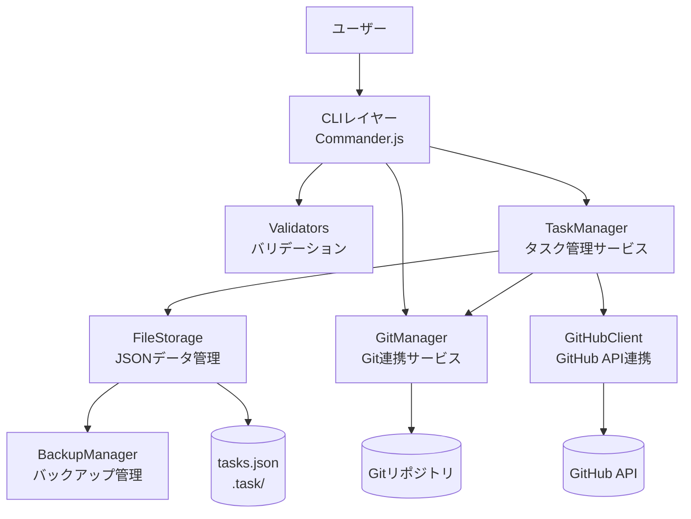
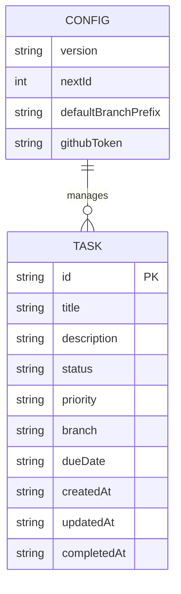
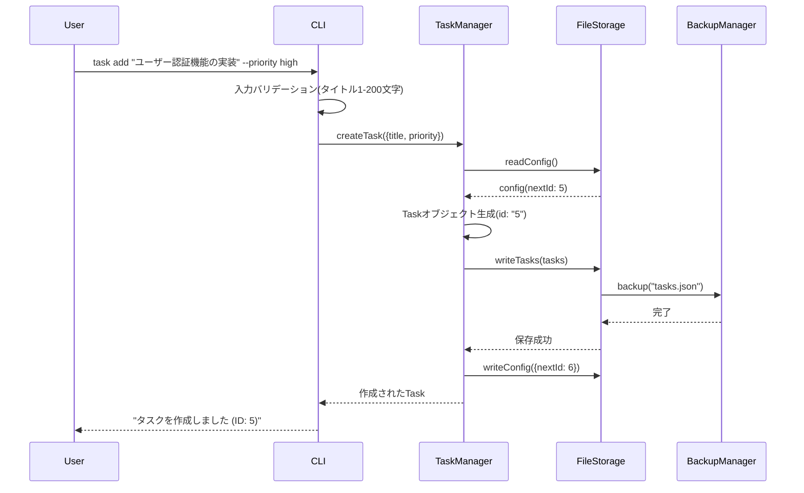
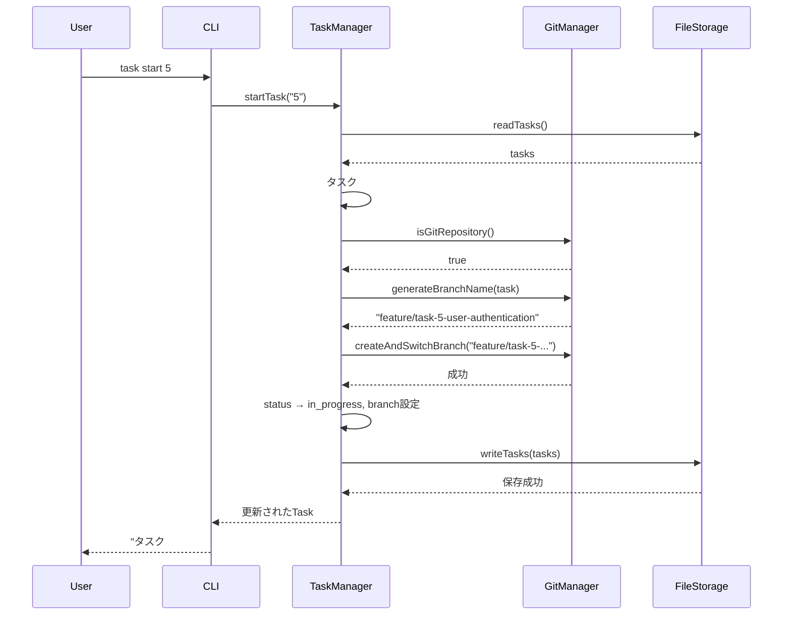
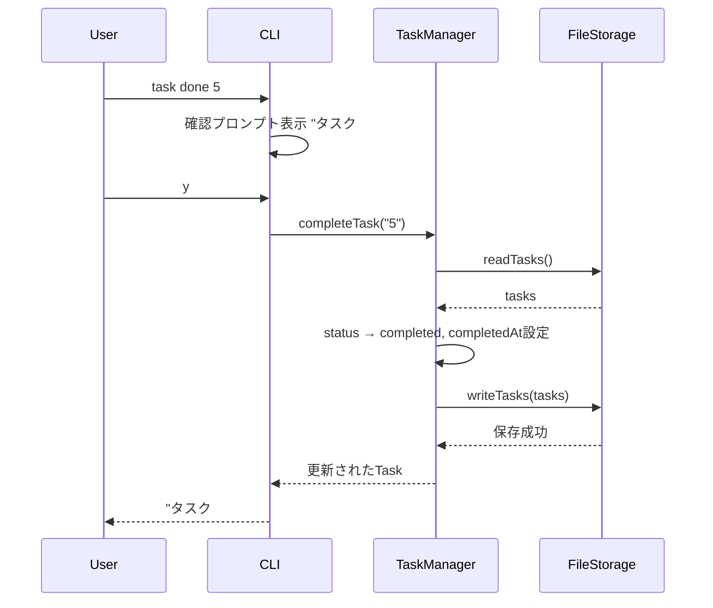
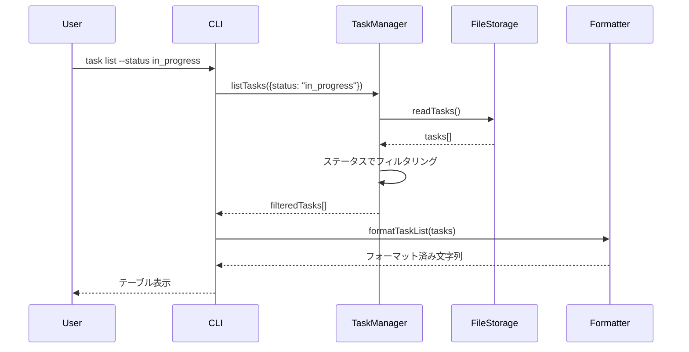
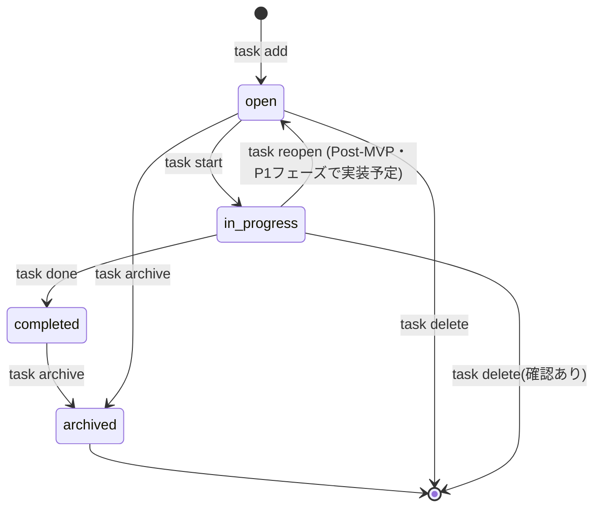

# 機能設計書 (Functional Design Document)

## システム構成図



---

## 技術スタック

| 分類 | 技術 | 選定理由 |
|------|------|----------|
| 言語 | TypeScript 5.x | 型安全性による開発効率とバグ防止 |
| ランタイム | Node.js v18以上(最低要件) / v24.11.0(推奨・開発環境) | クロスプラットフォーム対応、エコシステムの豊富さ |
| CLIフレームワーク | Commander.js | 学習コストが低く、機能が十分。最もシンプルな選択肢 |
| Git連携 | simple-git | Node.jsからGit操作を行う最標準的なライブラリ |
| テスト | Jest | TypeScript対応、豊富なmock機能 |
| データ保存(MVP) | JSON(fs) | 外部依存なし、Git管理可能、シンプル |
| データ保存(将来) | SQLite(better-sqlite3) | タスク増加時の検索性能向上のために移行予定 |
| GitHub API | @octokit/rest | GitHub公式クライアント、型定義が充実 |
| ターミナルUI | chalk + cli-table3 | カラーリングと表形式表示 |
| 確認プロンプト | inquirer | 削除・完了など破壊的操作前の y/N 確認ダイアログ |

---

## データモデル定義

### エンティティ: Task

```typescript
interface Task {
  id: string;                    // 採番された数値ID (1, 2, 3...)
  title: string;                 // 1-200文字
  description?: string;          // オプション、Markdown形式
  status: TaskStatus;            // タスクのライフサイクル状態
  priority?: TaskPriority;       // ユーザーが手動設定した優先度
  branch?: string;               // 紐付いたGitブランチ名
  dueDate?: string;              // ISO 8601形式 "YYYY-MM-DD"
  createdAt: string;             // ISO 8601形式
  updatedAt: string;             // ISO 8601形式
  completedAt?: string;          // 完了日時 ISO 8601形式
}

type TaskStatus = 'open' | 'in_progress' | 'completed' | 'archived';
type TaskPriority = 'high' | 'medium' | 'low';
```

**制約**:
- `id` は採番された正の整数を文字列として管理(例: "1", "2", "3")
- `title` は1文字以上200文字以下
- `status` の初期値は `open`
- `branch` は `task start <id>` 実行時に自動設定される

### エンティティ: Config

```typescript
interface Config {
  version: string;               // データフォーマットのバージョン (例: "1.0.0")
  nextId: number;                // 次に採番するID
  githubToken?: string;          // GitHub PAT (環境変数から取得を優先)
  defaultBranchPrefix: string;   // ブランチ名のプレフィックス (デフォルト: "feature/task-")
}
```

### ER図



---

## コンポーネント設計

### CLIレイヤー (`src/cli/`)

**責務**:
- ユーザー入力の受付とパース(Commander.js使用)
- 入力値のバリデーション
- サービスレイヤーへの処理委譲
- 結果のフォーマットと表示
- エラーメッセージの出力

**インターフェース**:
```typescript
// src/cli/index.ts - エントリーポイント
class TaskCLI {
  register(program: Command): void;  // サブコマンドを登録
  run(): void;                       // CLIを起動
}

// src/cli/commands/*.ts - 各コマンドのハンドラ
type CommandHandler = (args: string[], options: OptionValues) => Promise<void>;
```

**依存関係**:
- TaskManager
- Validators(入力バリデーション)
- Formatter(表示フォーマット)

---

### TaskManager (`src/services/TaskManager.ts`)

**責務**:
- タスクのCRUDビジネスロジック
- タスクIDの採番
- ステータス遷移の制御
- GitManagerとの連携調整

**インターフェース**:
```typescript
class TaskManager {
  createTask(data: CreateTaskInput): Promise<Task>;
  listTasks(filter?: TaskFilter): Promise<Task[]>;
  getTask(id: string): Promise<Task>;
  updateTask(id: string, data: UpdateTaskInput): Promise<Task>; // タイトル・説明・優先度・期限の更新
  startTask(id: string): Promise<Task>;        // status → in_progress & ブランチ作成
  completeTask(id: string): Promise<Task>;     // status → completed
  archiveTask(id: string): Promise<Task>;      // status → archived
  deleteTask(id: string): Promise<void>;
  searchTasks(keyword: string): Promise<Task[]>;  // P1フェーズで実装予定
}

interface CreateTaskInput {
  title: string;
  description?: string;
  priority?: TaskPriority;
  dueDate?: string;
}

interface UpdateTaskInput {
  title?: string;
  description?: string;
  priority?: TaskPriority;
  dueDate?: string;
}

interface TaskFilter {
  status?: TaskStatus;
  priority?: TaskPriority;
  sortBy?: 'id' | 'priority' | 'dueDate' | 'createdAt';
}
```

**依存関係**:
- FileStorage
- GitManager

---

### GitManager (`src/services/GitManager.ts`)

**責務**:
- Gitリポジトリの存在確認
- ブランチの作成・切り替え
- 現在のブランチ名の取得
- Git操作失敗時のロールバック

**インターフェース**:
```typescript
class GitManager {
  isGitRepository(): Promise<boolean>;
  getCurrentBranch(): Promise<string>;
  createAndSwitchBranch(branchName: string): Promise<void>;
  branchExists(branchName: string): Promise<boolean>;
  generateBranchName(task: Task): string;  // "feature/task-<id>-<slug>"
}
```

**依存関係**:
- simple-git

---

### GitHubClient (`src/services/GitHubClient.ts`)

**責務**:
- GitHub APIとの通信(P1機能)
- GitHub Issues の取得・作成・更新
- Personal Access Tokenによる認証

**同期仕様**:
- **同期方向**: GitHub Issue → ローカルタスク（一方向。ローカル変更が優先）
- **重複処理**: `Task` エンティティに `githubIssueNumber?: number` フィールドを持ち、同じ Issue 番号のタスクが既に存在する場合はスキップ
- **ID マッピング**: GitHub Issue 番号とローカルタスク ID は独立して管理（Issue #10 が必ずしもタスク ID 10 になるわけではない）

**インターフェース**:
```typescript
class GitHubClient {
  constructor(token: string);
  listIssues(owner: string, repo: string): Promise<GitHubIssue[]>;
  importIssueAsTask(issue: GitHubIssue): Promise<Task>;  // 重複時はスキップしてnullを返す
  syncTask(task: Task): Promise<void>;                    // ローカル→GitHub Issue へのステータス反映
}
```

**依存関係**:
- @octokit/rest

---

### FileStorage (`src/storage/FileStorage.ts`)

**責務**:
- JSONファイルへのデータ永続化と読み込み
- 変更前の自動バックアップ
- `.task/` ディレクトリの初期化

**インターフェース**:
```typescript
class FileStorage {
  initialize(): Promise<void>;             // .task/ ディレクトリと初期ファイル作成
  readTasks(): Promise<Task[]>;
  writeTasks(tasks: Task[]): Promise<void>; // 書き込み前にバックアップ実行
  readConfig(): Promise<Config>;
  writeConfig(config: Config): Promise<void>;
}
```

**依存関係**:
- BackupManager
- Node.js fs/promises

---

### BackupManager (`src/storage/BackupManager.ts`)

**責務**:
- データ変更前のバックアップファイル作成
- バックアップファイルの世代管理(最新5件を保持)

**インターフェース**:
```typescript
class BackupManager {
  backup(sourceFile: string): Promise<void>;   // タイムスタンプ付きバックアップ作成
  cleanup(): Promise<void>;                     // 古いバックアップを削除(5件超過時)
}
```

---

### Formatter (`src/cli/Formatter.ts`)

**責務**:
- タスク一覧のテーブル形式フォーマット
- ステータス・優先度のカラーリング
- 単一タスク詳細の表示フォーマット

**インターフェース**:
```typescript
class Formatter {
  formatTaskList(tasks: Task[]): string;
  formatTaskDetail(task: Task): string;
  formatSuccess(message: string): string;
  formatError(message: string): string;
}
```

---

## ユースケース図

### ユースケース1: タスク作成 (`task add`)



---

### ユースケース2: タスク開始 (`task start`)



---

### ユースケース3: タスク完了 (`task done`)



---

### ユースケース4: タスク一覧表示 (`task list`)



---

## ステータス遷移図



---

## UI設計

### タスク一覧表示 (`task list`)

**表示項目**:
| 列 | 内容 | フォーマット |
|----|------|------------|
| ID | タスクID | 数値 |
| Status | ステータス | カラーリング付きテキスト |
| Title | タイトル | 最大40文字(超過時は`...`で省略) |
| Branch | 紐付きブランチ | なし時は `-` |
| Due | 期限 | `YYYY-MM-DD` / `(あとN日)` |

**デフォルトソート**: ID 昇順（`--sort` オプション未指定時）

**表示例**:
```
ID  Status       Title                                    Branch                              Due
──  ───────────  ───────────────────────────────────────  ──────────────────────────────────  ──────────
1   in_progress  ユーザー認証機能の実装                    feature/task-1-user-authentication  -
2   open         データエクスポート機能                    -                                   2026-03-01
3   completed    初期セットアップ                          feature/task-3-initial-setup        -
```

### カラーコーディング

**ステータスの色分け**:
- `in_progress` (作業中): 黄色
- `completed` (完了): 緑
- `open` (新規): 白(デフォルト)
- `archived` (アーカイブ): グレー

**優先度の色分け**:
- `high` (高): 赤
- `medium` (中): 黄
- `low` (低): 青

### タスク詳細表示 (`task show <id>`)

```
タスク #1
  タイトル   : ユーザー認証機能の実装
  ステータス : in_progress (作業中)
  優先度     : high
  ブランチ   : feature/task-1-user-authentication
  期限       : -
  作成日時   : 2026-02-01 10:00:00
  更新日時   : 2026-02-10 14:30:00
  説明       :
    JWT認証を使ったログイン・ログアウト機能の実装。
```

---

## ファイル構造

**データ保存ディレクトリ**:
```
.task/
├── tasks.json         # タスクデータ本体
├── config.json        # ツール設定
└── backup/            # 自動バックアップ(最新5件)
    ├── tasks-20260201-100000.json
    ├── tasks-20260210-143000.json
    └── ...
```

**tasks.json の形式**:
```json
{
  "tasks": [
    {
      "id": "1",
      "title": "ユーザー認証機能の実装",
      "description": "JWT認証を使ったログイン・ログアウト機能の実装。",
      "status": "in_progress",
      "priority": "high",
      "branch": "feature/task-1-user-authentication",
      "dueDate": null,
      "createdAt": "2026-02-01T10:00:00.000Z",
      "updatedAt": "2026-02-10T14:30:00.000Z",
      "completedAt": null
    }
  ]
}
```

**config.json の形式**:
```json
{
  "version": "1.0.0",
  "nextId": 2,
  "defaultBranchPrefix": "feature/task-"
}
```

---

## ブランチ名生成ロジック

```typescript
function generateBranchName(task: Task, prefix: string): string {
  // タイトルをslug形式に変換
  const slug = task.title
    .toLowerCase()
    .replace(/[^\w\s-]/g, '')        // 英数字・スペース・ハイフン以外を除去
    .replace(/[\s_]+/g, '-')         // スペース・アンダースコアをハイフンに変換
    .replace(/^-+|-+$/g, '')         // 先頭・末尾のハイフンを除去
    .slice(0, 50);                   // 最大50文字

  return `${prefix}${task.id}-${slug}`;
  // 例: "feature/task-1-user-authentication"
}
```

---

## パフォーマンス最適化

- **遅延読み込み**: タスクデータはコマンド実行時にのみ読み込む(起動時の事前読み込みなし)
- **直列書き込み**: データ破損防止のため、書き込みは Promise チェーンで直列化し同時書き込みを防止する（ロックファイルは使用しない）
- **ファイルキャッシュ**: 同一コマンド実行中の複数回読み込みをメモリキャッシュで回避
- **出力バッファリング**: 大量タスク表示時はバッファリングして一括出力

---

## セキュリティ考慮事項

- **GitHub Token管理**: `TASKCLI_GITHUB_TOKEN` 環境変数から取得を優先。`config.json` への平文保存は非推奨(警告表示)
- **ファイルパーミッション**: `.task/config.json` は作成時に `600` (オーナーのみ読み書き)を設定
- **コマンドインジェクション対策**: ブランチ名生成時はalpha-numeric+ハイフンのみに制限。`simple-git` ライブラリ経由でGit操作し、シェルコマンドの直接実行は行わない
- **パストラバーサル対策**: ファイルパスは `path.resolve` で正規化し、`.task/` ディレクトリ外へのアクセスを防止

---

## エラーハンドリング

### エラーの分類

| エラー種別 | 処理 | ユーザーへの表示 |
|-----------|------|-----------------|
| 入力バリデーションエラー | 処理を中断 | `Error: タイトルは1〜200文字で入力してください` |
| タスクが見つからない | 処理を中断 | `Error: タスク #99 が見つかりません` |
| Gitリポジトリなし | ブランチ連携をスキップ | `Warning: Gitリポジトリが見つかりません。タスクのみ作成します` |
| ブランチ作成失敗 | タスクのステータス変更をロールバック | `Error: ブランチの作成に失敗しました: <git error>` |
| ファイル読み込みエラー | 初期データで継続 | `Warning: データファイルを読み込めません。新規作成します` |
| ファイル書き込みエラー | 処理を中断 | `Error: データの保存に失敗しました: <system error>` |
| GitHub API認証失敗 | 処理を中断 | `Error: GitHub認証に失敗しました。TASKCLI_GITHUB_TOKEN を確認してください` |
| 不正なステータス遷移 | 処理を中断 | `Error: completed のタスクは start できません` |

### エラーコードと終了ステータス

```typescript
enum ExitCode {
  SUCCESS = 0,
  VALIDATION_ERROR = 1,
  NOT_FOUND = 2,
  GIT_ERROR = 3,
  STORAGE_ERROR = 4,
  GITHUB_ERROR = 5,
}
```

---

## テスト戦略

### ユニットテスト

- **TaskManager**: 各メソッドのビジネスロジック(ステータス遷移、フィルタリング、採番)
- **GitManager**: ブランチ名生成ロジック、Git操作のモック
- **FileStorage**: ファイル読み書き、バックアップ生成のモック
- **Formatter**: 各フォーマット出力の文字列検証
- **バリデーション**: 各入力値の境界値テスト(空文字、200文字、201文字)

### 統合テスト

- `task add` → `task list` → `task start` → `task done` の一連フロー
- Gitリポジトリあり/なし環境でのブランチ連携動作
- バックアップ作成と世代管理の動作確認

### E2Eテスト

- 実際のCLIコマンドを実行し、標準出力と `.task/tasks.json` の内容を検証
- Git初期化済みの一時ディレクトリでのブランチ作成・切り替えを検証

### カバレッジ目標

| 対象 | 目標 |
|------|------|
| 全体 | 80%以上 |
| `src/services/`（TaskManager 等） | 90%以上（ビジネスロジックの中核） |
| `src/validators/` | 100%（境界値を全てカバー） |
| `src/cli/` | 60%以上（表示ロジックは E2E で補完） |
