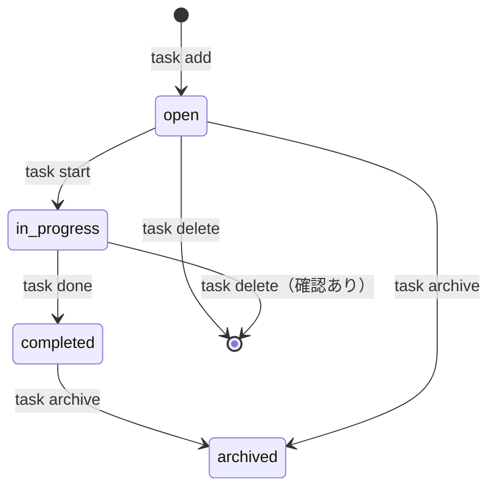

# プロジェクト用語集 (Glossary)

## 概要

このドキュメントは、TaskCLI プロジェクト内で使用される用語の定義を管理します。
ドメイン用語・技術用語・略語・アーキテクチャ概念を統一的に定義し、
チーム全員が同じ言葉で会話できることを目的とします。

**更新日**: 2026-02-18

---

## ドメイン用語

プロジェクト固有のビジネス概念や機能に関する用語。

---

### タスク

**定義**: ユーザーが完了すべき作業の単位。

**説明**:
TaskCLI が管理する基本データ。タイトル・説明・ステータス・優先度・期限・紐付きブランチを持つ。
タスクは作成から完了・アーカイブまでのライフサイクルを持ち、Gitブランチと1対1で紐付けられる。

**関連用語**:
- [タスクステータス](#タスクステータス): タスクの進行状態
- [タスク優先度](#タスク優先度): タスクの重要度
- [ブランチ連携](#ブランチ連携): タスクとGitブランチの紐付け

**使用例**:
- 「タスクを追加する」: `task add "ユーザー認証機能の実装"` を実行する
- 「タスクを開始する」: `task start 1` を実行してブランチを作成し作業を開始する
- 「タスクを完了する」: `task done 1` を実行してステータスを completed に変更する

**英語表記**: Task

**データモデル**: `src/types/index.ts` の `Task` インターフェース

---

### タスクステータス

**定義**: タスクの進行状態を示す4段階の状態。

**取りうる値**:

| ステータス | 意味 | 遷移条件 | 次の状態 |
|----------|------|---------|---------|
| `open` | 新規・未着手 | タスク作成時の初期状態 | `in_progress`, `archived` |
| `in_progress` | 作業中 | `task start <id>` を実行 | `completed` |
| `completed` | 完了 | `task done <id>` を実行 | `archived` |
| `archived` | アーカイブ | `task archive <id>` を実行 | なし（終端状態） |

**状態遷移図**:


**ビジネスルール**:
- `open` から `completed` への直接遷移は禁止（必ず `in_progress` を経由）
- `archived` 状態からの遷移は不可
- `in_progress` のタスクを削除する際は確認プロンプトを表示

**英語表記**: Task Status

**実装箇所**: `src/types/index.ts`

---

### タスク優先度

**定義**: タスクの重要度と緊急度を示す3段階の指標。ユーザーが手動で設定する。

**取りうる値**:

| 優先度 | 意味 | 想定シーン |
|-------|------|----------|
| `high` | 高優先度 | 緊急バグ修正、リリースブロッカー |
| `medium` | 中優先度 | 通常の機能開発 |
| `low` | 低優先度 | Nice-to-have の改善、後回し可能な作業 |

**使用例**:
```bash
task add "セキュリティ脆弱性の修正" --priority high
task list --sort priority
```

**英語表記**: Task Priority

---

### ブランチ連携

**定義**: タスクとGitブランチを1対1で紐付け、タスク開始時にブランチを自動作成・切り替えする機能。

**説明**:
`task start <id>` を実行すると、`feature/task-<id>-<タイトルのslug>` 形式のブランチが
自動作成・切り替えされる。タスクの `branch` フィールドにブランチ名が記録される。
Gitリポジトリが存在しない環境では、ブランチ連携をスキップしてタスク管理のみ動作する。

**使用例**:
```bash
task start 1
# → 自動で feature/task-1-user-authentication ブランチを作成・切り替え
```

**英語表記**: Branch Integration

**関連用語**:
- [GitManager](#gitmanager): ブランチ連携を実装するサービスクラス
- [ブランチ名スラッグ変換](#ブランチ名スラッグ変換): ブランチ名の生成ロジック

---

### ブランチ名スラッグ変換

**定義**: タスクタイトルからGitブランチ名に使用できる文字列（スラッグ）を生成する処理。

**変換ルール**:
1. タイトルを小文字に変換
2. 英数字・スペース・ハイフン以外の文字を除去（日本語・記号を除去）
3. スペース・アンダースコアをハイフンに変換
4. 先頭・末尾のハイフンを除去
5. 最大50文字に切り詰め

**生成フォーマット**: `<prefix><id>-<slug>`

**使用例**:
```
タスクID: 1
タイトル: "ユーザー認証機能の実装"
slug: "" (日本語は除去されるため空)
→ ブランチ名: feature/task-1

タスクID: 5
タイトル: "Add login endpoint"
slug: "add-login-endpoint"
→ ブランチ名: feature/task-5-add-login-endpoint
```

**実装箇所**: `src/services/GitManager.ts` の `generateBranchName()` メソッド

---

### バックアップ

**定義**: タスクデータ（`tasks.json`）への書き込み前に自動作成される、データのコピーファイル。

**説明**:
データ破損・誤操作からの復旧を可能にするため、`FileStorage.writeTasks()` の実行前に
必ずバックアップを作成する。最新5件を保持し、古いものは自動削除される。

**保存先**: `.task/backup/tasks-YYYYMMDD-HHmmss.json`

**世代管理**: 最新5件を保持（6件目以降は古いものから自動削除）

**英語表記**: Backup

**関連用語**: [BackupManager](#backupmanager)

---

## 技術用語

プロジェクトで使用している技術・フレームワーク・ツールに関する用語。

---

### TypeScript

**定義**: JavaScriptに静的型付けを追加したプログラミング言語。Microsoftが開発・管理。

**本プロジェクトでの用途**: 全てのソースコードをTypeScriptで記述し、型安全性を確保している。

**バージョン**: 5.x

**選定理由**: 静的型付けによるコンパイル時バグ検出、IDEの補完機能による開発効率向上、インターフェース定義による設計の明確化。

**関連ドキュメント**: [アーキテクチャ設計書](./architecture.md#テクノロジースタック)

**設定ファイル**: `tsconfig.json`

---

### Commander.js

**定義**: Node.js向けのCLIフレームワークライブラリ。サブコマンド・オプション・ヘルプ表示の自動生成を提供する。

**本プロジェクトでの用途**: `task add` / `task list` / `task start` 等のサブコマンド定義と引数・オプションのパース。

**バージョン**: ^12.0.0

**選定理由**: Node.js CLIの事実上の標準。学習コストが低く、ヘルプ自動生成・型安全なオプション定義が可能。

**実装箇所**: `src/cli/index.ts`

---

### simple-git

**定義**: Node.jsからGitコマンドを操作するためのラッパーライブラリ。

**本プロジェクトでの用途**: ブランチの作成・切り替え、Gitリポジトリの存在確認、現在のブランチ名取得。

**バージョン**: ^3.0.0

**選定理由**: Gitコマンドのシンプルなラッパーで、最も直感的なAPIを提供する。

**実装箇所**: `src/services/GitManager.ts`

---

### chalk

**定義**: Node.jsのターミナル出力に色を付けるためのライブラリ。

**本プロジェクトでの用途**: タスクステータス・優先度のカラーリング（`in_progress` は黄色、`completed` は緑など）。

**バージョン**: ^5.0.0（ESM対応版）

**実装箇所**: `src/cli/Formatter.ts`

---

### @octokit/rest

**定義**: GitHub REST APIを操作するための公式JavaScriptクライアントライブラリ。

**本プロジェクトでの用途**: GitHub Issues の取得・作成・更新（P1機能: GitHub連携）。

**バージョン**: ^20.0.0

**選定理由**: GitHub公式クライアント。型定義が充実しており、型安全にAPIを呼び出せる。

**実装箇所**: `src/services/GitHubClient.ts`

---

### Jest

**定義**: JavaScript/TypeScript向けのテストフレームワーク。テスト実行・アサーション・モック機能を一体的に提供する。

**本プロジェクトでの用途**: ユニットテスト・統合テスト・E2Eテストの全てを統一的に管理。

**バージョン**: ^29.0.0

**設定ファイル**: `jest.config.ts`

**関連ドキュメント**: [開発ガイドライン](./development-guidelines.md#テスト戦略)

---

## 略語・頭字語

---

### CLI

**正式名称**: Command Line Interface（コマンドラインインターフェース）

**意味**: ターミナル（コマンドプロンプト）からテキストコマンドで操作するインターフェース。

**本プロジェクトでの使用**: TaskCLI のメインインターフェース。ユーザーは `task add "タスク"` のようなコマンドで全操作を行う。

**実装箇所**: `src/cli/` ディレクトリ

---

### CRUD

**正式名称**: Create, Read, Update, Delete

**意味**: データ操作の基本4操作（作成・読み取り・更新・削除）の総称。

**本プロジェクトでの使用**: タスクのCRUD操作（`task add` / `task list` / `task show` / `task delete`）を指す。

---

### MVP

**正式名称**: Minimum Viable Product（最小実行可能プロダクト）

**意味**: ユーザーに価値を提供できる最小限の機能を持つプロダクトの状態。

**本プロジェクトでの使用**: PRDで P0（必須）として定義された機能（タスクCRUD・ステータス管理・Gitブランチ連携・タスク一覧表示）のみを実装した初期リリース状態。

---

### PAT

**正式名称**: Personal Access Token（個人アクセストークン）

**意味**: GitHub APIへのアクセス認証に使用するトークン文字列。GitHub設定画面で発行する。

**本プロジェクトでの使用**: GitHub Issues連携（P1機能）の認証に使用。環境変数 `TASKCLI_GITHUB_TOKEN` で管理する。

**セキュリティ**: 設定ファイルへの平文保存禁止。環境変数での管理を必須とする。

---

### PRD

**正式名称**: Product Requirements Document（プロダクト要求定義書）

**意味**: プロダクトの目的・ターゲットユーザー・機能要件・非機能要件を定義するドキュメント。

**本プロジェクトでの使用**: `docs/product-requirements.md` として管理。

---

## アーキテクチャ用語

---

### レイヤードアーキテクチャ

**定義**: システムを役割ごとに複数の層に分割し、上位層から下位層への一方向の依存関係を持たせる設計パターン。

**本プロジェクトでの適用**: 3層構造を採用。

```
CLIレイヤー (src/cli/)        ← ユーザー入力・表示
    ↓
サービスレイヤー (src/services/) ← ビジネスロジック
    ↓
ストレージレイヤー (src/storage/) ← データ永続化
```

**メリット**: 関心の分離による保守性向上、各層を独立してテスト可能、変更の影響範囲が限定的。

**依存関係ルール**:
- ✅ CLIレイヤー → サービスレイヤー
- ✅ サービスレイヤー → ストレージレイヤー
- ❌ ストレージレイヤー → サービスレイヤー（禁止）
- ❌ サービスレイヤー → CLIレイヤー（禁止）

**関連ドキュメント**: [アーキテクチャ設計書](./architecture.md#アーキテクチャパターン)

---

### IStorage

**定義**: ストレージレイヤーの抽象化インターフェース。JSONとSQLiteなど異なるストレージ実装を差し替え可能にする。

**本プロジェクトでの適用**: `FileStorage`（JSON実装）が `IStorage` を実装する。将来のSQLite移行時も上位レイヤーへの影響なしに差し替え可能。

**実装箇所**: `src/types/index.ts`

```typescript
interface IStorage {
  readTasks(): Promise<Task[]>;
  writeTasks(tasks: Task[]): Promise<void>;
  readConfig(): Promise<Config>;
  writeConfig(config: Config): Promise<void>;
}
```

---

### TaskManager

**定義**: タスク管理のビジネスロジックを実装するサービスクラス。アーキテクチャのサービスレイヤーの中核。

**責務**: タスクのCRUD操作・ステータス遷移制御・ID採番・GitManagerとの連携調整。

**実装箇所**: `src/services/TaskManager.ts`

**依存**: `FileStorage`（IStorage経由）、`GitManager`

---

### GitManager

**定義**: Gitリポジトリへのアクセスとブランチ操作を担当するサービスクラス。

**責務**: Gitリポジトリの存在確認、ブランチ名の生成、ブランチの作成・切り替え、Git操作失敗時のエラー通知。

**実装箇所**: `src/services/GitManager.ts`

**依存**: `simple-git` ライブラリ

---

### FileStorage

**定義**: `.task/tasks.json` と `.task/config.json` へのデータ読み書きを担当するストレージクラス。

**責務**: JSONファイルの読み書き、`BackupManager` を通じた自動バックアップ、`.task/` ディレクトリの初期化。

**実装箇所**: `src/storage/FileStorage.ts`

---

### BackupManager

**定義**: タスクデータの書き込み前に自動バックアップを作成し、世代管理を行うクラス。

**責務**: タイムスタンプ付きバックアップファイルの作成、最新5件を超えた古いバックアップの自動削除。

**実装箇所**: `src/storage/BackupManager.ts`

---

## エラー・例外

---

### TaskCLIError

**クラス名**: `TaskCLIError`

**継承元**: `Error`

**定義**: 全ての TaskCLI 固有エラーの基底クラス。`exitCode` プロパティで終了コードを管理する。

**発生条件**: 直接使用しない。サブクラス（`NotFoundError` / `ValidationError` / `GitError`）を使用する。

**関連用語**: [NotFoundError](#notfounderror), [ValidationError](#validationerror), [GitError](#giterror)

---

### ValidationError

**クラス名**: `ValidationError`

**継承元**: `TaskCLIError`

**発生条件**: ユーザー入力がビジネスルールに違反した場合（タイトルが空、文字数超過、不正な優先度値など）。

**エラーコード（終了ステータス）**: 1

**対処方法**:
- ユーザー: エラーメッセージに従って入力値を修正する
- 開発者: `src/validators/taskValidators.ts` のバリデーションロジックを確認する

**使用例**:
```typescript
if (title.length === 0) {
  throw new ValidationError('タイトルは1〜200文字で入力してください', 'title');
}
```

---

### NotFoundError

**クラス名**: `NotFoundError`

**継承元**: `TaskCLIError`

**発生条件**: 指定されたIDのタスクが存在しない場合。

**エラーコード（終了ステータス）**: 2

**エラーメッセージフォーマット**: `タスク #<id> が見つかりません`

**対処方法**:
- ユーザー: `task list` で存在するタスクIDを確認してから再実行する
- 開発者: `TaskManager.getTask()` を呼び出す前にIDの検証を行う

---

### GitError

**クラス名**: `GitError`

**継承元**: `TaskCLIError`

**発生条件**: Gitブランチの作成・切り替えに失敗した場合。

**エラーコード（終了ステータス）**: 3

**対処方法**:
- ユーザー: Git の状態を確認し（`git status`）、問題を解決してから再実行する
- 開発者: `src/services/GitManager.ts` のエラーハンドリングを確認する

**副作用**: Git操作失敗時はタスクのステータス変更をロールバックする（in_progress への変更は反映しない）。

---

## ステアリング・開発プロセス用語

---

### ステアリングファイル

**定義**: 特定の開発作業における「今回何をするか」を定義する作業単位のドキュメント群。

**説明**:
作業ごとに `.steering/[YYYYMMDD]-[タスク名]/` ディレクトリを作成し、3つのファイルで管理する。
作業履歴として保持する。

**ディレクトリ構造**:
```
.steering/
└── 20260218-add-github-sync/
    ├── requirements.md    # 今回の作業の要求内容
    ├── design.md          # 実装アプローチの設計
    └── tasklist.md        # 具体的なタスクリスト（進捗も管理）
```

**英語表記**: Steering File

---

### 永続ドキュメント

**定義**: プロジェクト全体の「何を作るか」「どう作るか」を定義し、長期的に保持されるドキュメント。

**保存先**: `docs/` ディレクトリ

**種類**:
- `product-requirements.md`: プロダクト要求定義書（PRD）
- `functional-design.md`: 機能設計書
- `architecture.md`: アーキテクチャ設計書
- `repository-structure.md`: リポジトリ構造定義書
- `development-guidelines.md`: 開発ガイドライン
- `glossary.md`: 用語集（本ドキュメント）

**英語表記**: Persistent Document

---

## 索引

### あ行
- [アーカイブ（タスクステータス）](#タスクステータス)

### い行
- [IStorage](#istorage)

### え行
- [エラー](#エラー・例外)

### か行
- [GitError](#giterror)
- [Git連携（ブランチ連携）](#ブランチ連携)

### さ行
- [サービスレイヤー](#レイヤードアーキテクチャ)
- [ステアリングファイル](#ステアリングファイル)
- [ストレージレイヤー](#レイヤードアーキテクチャ)

### た行
- [タスク](#タスク)
- [タスクステータス](#タスクステータス)
- [タスク優先度](#タスク優先度)

### な行
- [NotFoundError](#notfounderror)

### は行
- [バックアップ](#バックアップ)
- [BackupManager](#backupmanager)
- [ブランチ連携](#ブランチ連携)
- [ブランチ名スラッグ変換](#ブランチ名スラッグ変換)

### ま行
- [MVP](#mvp)

### ら行
- [レイヤードアーキテクチャ](#レイヤードアーキテクチャ)

### わ行
- [ValidationError](#validationerror)

### A-Z
- [BackupManager](#backupmanager)
- [chalk](#chalk)
- [CLI](#cli)
- [Commander.js](#commanderjs)
- [CRUD](#crud)
- [FileStorage](#filestorage)
- [GitError](#giterror)
- [GitHubClient（@octokit/rest）](#octokitrest)
- [GitManager](#gitmanager)
- [IStorage](#istorage)
- [Jest](#jest)
- [NotFoundError](#notfounderror)
- [PAT](#pat)
- [PRD](#prd)
- [simple-git](#simple-git)
- [TaskCLIError](#taskcliror)
- [TaskManager](#taskmanager)
- [TypeScript](#typescript)
- [ValidationError](#validationerror)
- [@octokit/rest](#octokitrest)
